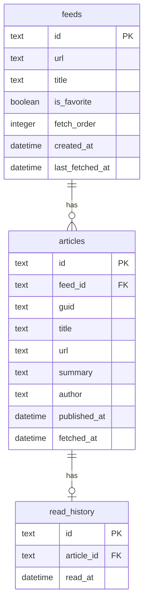
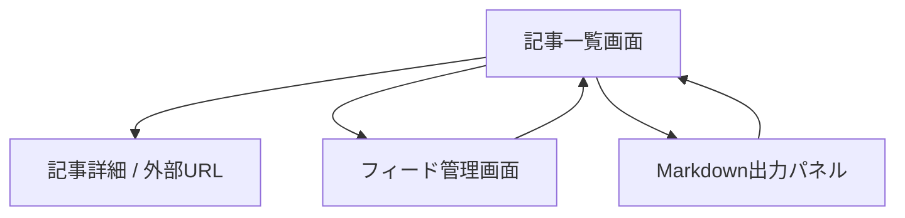
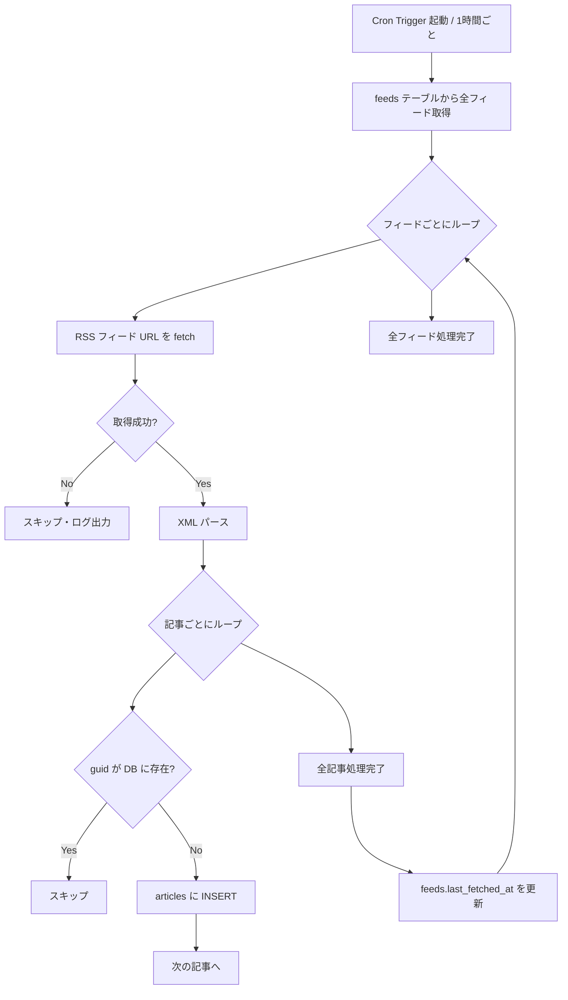

# 機能設計書

## システム構成図

```
┌─────────────────────────────────────────────────┐
│                Cloudflare                        │
│                                                  │
│  ┌──────────────┐      ┌──────────────────────┐ │
│  │    Pages     │      │      Workers         │ │
│  │  (React UI)  │─────▶│  - REST API          │ │
│  └──────────────┘      │  - Cron Trigger      │ │
│                         │    (1時間に1回)       │ │
│                         └──────────┬───────────┘ │
│                                    │             │
│                         ┌──────────▼───────────┐ │
│                         │        D1            │ │
│                         │  (SQLite互換 DB)     │ │
│                         └──────────────────────┘ │
└─────────────────────────────────────────────────┘
                              │
                    ┌─────────▼──────────┐
                    │  外部 RSS フィード  │
                    │  (各サイト)        │
                    └────────────────────┘
```

-----

## データモデル定義

### ER図



### テーブル定義

#### `feeds` テーブル

|カラム            |型          |説明                |
|---------------|-----------|------------------|
|id             |TEXT (UUID)|主キー               |
|url            |TEXT       |RSS フィード URL      |
|title          |TEXT       |サイト名（自動取得 or 手動設定）|
|is_favorite    |BOOLEAN    |お気に入りフラグ（優先表示用）   |
|fetch_order    |INTEGER    |優先表示の並び順          |
|created_at     |DATETIME   |登録日時              |
|last_fetched_at|DATETIME   |最終フィード取得日時        |

#### `articles` テーブル

|カラム         |型          |説明                       |
|------------|-----------|-------------------------|
|id          |TEXT (UUID)|主キー                      |
|feed_id     |TEXT       |feeds.id への外部キー          |
|guid        |TEXT       |RSS の GUID（重複排除に使用）      |
|title       |TEXT       |記事タイトル                   |
|url         |TEXT       |記事 URL                   |
|summary     |TEXT       |概要テキスト（RSS の description）|
|author      |TEXT       |ライター名（取得できる場合）           |
|published_at|DATETIME   |記事の公開日時                  |
|fetched_at  |DATETIME   |DB への保存日時                |

#### `read_history` テーブル

|カラム       |型          |説明                |
|----------|-----------|------------------|
|id        |TEXT (UUID)|主キー               |
|article_id|TEXT       |articles.id への外部キー|
|read_at   |DATETIME   |既読にした日時           |

-----

## 画面遷移図



-----

## 画面設計

### 1. 記事一覧画面（メイン画面）

```
┌──────────────────────────────────────────┐
│ 🗞 RSS Reader          [フィード管理]     │
│                        [未読のみ ●]      │
├──────────────────────────────────────────┤
│ ★ お気に入り                             │
│ ┌────────────────────────────────────┐   │
│ │ □ サイト名 · 2時間前               │   │
│ │   記事タイトルが入ります           │   │
│ │   概要テキストの冒頭が表示されます │   │
│ └────────────────────────────────────┘   │
│ ┌────────────────────────────────────┐   │
│ │ □ サイト名 · 3時間前               │   │
│ │   ...                              │   │
│ └────────────────────────────────────┘   │
│                                          │
│ その他                                   │
│ ┌────────────────────────────────────┐   │
│ │ □ サイト名 · 1時間前               │   │
│ │   ...                              │   │
│ └────────────────────────────────────┘   │
│                                          │
│ ──────────── 選択中: 2件 ────────────── │
│ [クリップボードにコピー]  [選択解除]     │
└──────────────────────────────────────────┘
```

**動作仕様：**

- デフォルトは未読記事のみ表示。トグルで既読も表示可
- お気に入りフィードの記事はセクション上部にまとめて表示
- 各セクション内は `published_at` 降順
- 記事タイトルをクリックで元記事を新タブで開く（既読マークを付与）
- チェックボックスをクリックで選択状態をトグル
- 1件以上選択時、画面下部に「コピー」バーを表示

### 2. フィード管理画面

```
┌──────────────────────────────────────────┐
│ ← 戻る   フィード管理                    │
├──────────────────────────────────────────┤
│ [+ フィードを追加]                        │
│                                          │
│ ★ お気に入り                             │
│ ┌────────────────────────────────────┐   │
│ │ ★ Zenn        zenn.dev/feed        │   │
│ │               最終取得: 10分前 [✕] │   │
│ └────────────────────────────────────┘   │
│                                          │
│ その他                                   │
│ ┌────────────────────────────────────┐   │
│ │ ☆ Hacker News  ...                 │   │
│ │               最終取得: 1時間前 [✕]│   │
│ └────────────────────────────────────┘   │
└──────────────────────────────────────────┘
```

**動作仕様：**

- フィードURL入力→タイトル自動取得→登録
- ★アイコンでお気に入りトグル
- ✕ で削除（確認ダイアログあり）

### 3. Markdown出力（コピーバー）

選択記事を以下の形式でクリップボードにコピーする：

```markdown
- [記事タイトルA](https://example.com/article-a)
- [記事タイトルB](https://example.com/article-b)
```

コピー成功後、トースト通知（「コピーしました ✓」）を表示。

-----

## API設計

### Workers エンドポイント一覧

|メソッド  |パス                      |説明               |
|------|------------------------|-----------------|
|GET   |`/api/articles`         |記事一覧取得（未読/既読フィルタ）|
|POST  |`/api/articles/:id/read`|記事を既読にする         |
|GET   |`/api/feeds`            |フィード一覧取得         |
|POST  |`/api/feeds`            |フィード登録           |
|PATCH |`/api/feeds/:id`        |フィード更新（お気に入り等）   |
|DELETE|`/api/feeds/:id`        |フィード削除           |
|POST  |`/api/cron/fetch`       |フィード手動更新（開発用）    |

### GET `/api/articles` クエリパラメータ

|パラメータ      |型      |デフォルト|説明       |
|-----------|-------|-----|---------|
|unread_only|boolean|true |未読のみ取得   |
|limit      |number |50   |取得件数上限   |
|offset     |number |0    |ページネーション用|

-----

## Cron Trigger 処理フロー



-----

## コンポーネント設計

```
src/
├── components/
│   ├── ArticleCard.tsx       # 記事カード（チェックボックス含む）
│   ├── ArticleList.tsx       # 記事一覧（お気に入り/その他セクション）
│   ├── CopyBar.tsx           # 選択中記事のコピーバー
│   ├── FeedForm.tsx          # フィード登録フォーム
│   ├── FeedList.tsx          # フィード一覧
│   └── Toast.tsx             # トースト通知
├── hooks/
│   ├── useArticles.ts        # 記事取得・既読管理
│   ├── useFeeds.ts           # フィード管理
│   └── useSelection.ts      # 記事選択状態管理
└── pages/
    ├── index.tsx             # 記事一覧画面
    └── feeds.tsx             # フィード管理画面
```